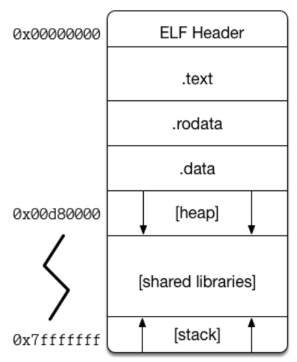

# How does a C program executes? 
Reversing programs involves comprehending different sorts of code, such as a `zip` file or maybe just an `ELF` executable. In order to be prepared to face peculiar appearences of a simple applications, we must comprehend how a program is executed in a machine, and, to do so, we'll get started by analysing a **C program**: from stages of converting the source code, to linking libraires, for example.

## A text file
Usually, the steps for creating your source code are always the same: you open your preferred text editor/IDE, write some code and then save it somewhere on your machine.
Have in mind that this is not yet our program: we simply created a text file, which is stored in secondary memory (HDD/SSD). To make it a "program" (executable), we need to transform a texte file into an [ELF 64bits object](https://en.wikipedia.org/wiki/Executable_and_Linkable_Format).

Consider the following C code:

```C
/*
  NOTE: You can find it at the "examples" folders as "example1.c"
*/

#include <stdio.h>
#include <stdlib.h>

int global_var;
int init_global_var = 5;

void function(){
        int stack_var;
        int init_stack_var = 30;

        char buff_var[32];

        printf("function's stack_var is at address %p\n", &stack_var);
        printf("function's init_stack_var is at address %p\n", &init_stack_var);
        printf("function's buff_var is at address %p\n", buff_var);
}

int main(int argc, char **argv){
        int stack_var;
        int init_stack_var = 10;

        static int static_var;
        static int init_static_var = 20;

        char buff_var[32];

        int *heap_var_ptr;
        heap_var_ptr = (int *) malloc(32);

        printf("the first command line argument is at address %p\n\n", &argv[0]);

        printf("program's init_global_var is at address %p\n", &init_global_var);
        printf("main's init_static var is at address %p\n\n", &init_static_var);

        printf("program's global_var is at address %p\n", &global_var);
        printf("main's static_var_ptr is at address %p\n\n", &static_var);

        printf("main's heap_var is at address %p\n\n", heap_var_ptr);

        printf("main's stack_var is at address %p\n", &stack_var);
        printf("main's init_stack_var is at address %p\n", &init_stack_var);
        printf("main's buff_var is at address %p\n\n", &buff_var);

        function();

        char exit;
        printf("\nwaiting...\n");
        scanf("%c", &exit);

        return 0;
}
```

On terminal, we can see what kind of file it is by using the `file` command:

```
$ file ./example1.c
./example1.c: C source, ASCII text
```

As mentioned previously, `example1.c` is a text file, more precisely an [ASCII](https://en.wikipedia.org/wiki/ASCII) text, meaning it contains only ASCII characters (check [this](https://www.asciitable.com/) table). Basically, all we've to do now is to **compile** this text into an object, but the process of compilation is very complex, so we'll get an overview of it and highlight the important stages.

## Compilation
The process of compilation can be divided into 4 stages:

1. Preprocessing.
2. Compilation.
3. Assembly.
4. Linking.

Initially, the preprocessing stage will interpret preprocessing directives in your code (lines starting with `#`), which will expand [header files](https://gcc.gnu.org/onlinedocs/cpp/Header-Files.html) and create macros, to reduce repetition of code, for example, and also remove comments. Following, compilation will translate the code generated in the previous stage to assembly instructions specific to the target processor. Next, an assembler will convert the assembly instructions generated by the compilation stage, into object code (what your computer actually understadands!). Finally, a linker will be used to link function references in our code to their respective libraries: for instance, a call to `printf()` would require its address on `libc` to be loaded into our code, so that, instead of copying all printf's code, we go to it's address and execute what's in there (see [dynamic linking](https://medium.com/@bdov_/https-medium-com-bdov-c-dynamic-libraries-what-why-and-how-66cf777019a7)).

Practically, this can be achieved with the use of GCC ([here](https://en.wikipedia.org/wiki/GNU_Compiler_Collection) for more details), which is the compiler we'll be using throughout this material. On terminal, we can use the `GCC` command:

```
$ gcc ./example1.c -o example1
```

This will take the current directory `example1.c` file as input, and compile it with the flag `-o`, which will generate `example1` as the output executable. Also, with the `file` command we can confirm that it's indeed an executable:

```
$ file ./example1
example1: ELF 64-bit LSB shared object, x86-64, version 1 (SYSV), dynamically linked, interpreter /lib64/ld-linux-x86-64.so.2, BuildID[sha1]=44207b0f09a72d6971273de348ebb0c95d17cd04, for GNU/Linux 3.2.0, not stripped
```

Notice that we can only execute `example1` because the output file has permissions to be executed. We can verify it using the `ls` command alongside the `-l` flag:

```
$ ls -l
-rwxrwxr-x [...] example1
-rw-rw-r-- [...] example1.c
```

The output show us that `example1` has permissions for the `user`, `group` and `others` to execute it ([here](https://www.pair.com/support/kb/file-permissions/) for more details), whereas our text file `example1.c` doesn't. Even if we used the `chmod` command to give executable permissions to the latter, the machine would try to execute the text as instructions, which would certainly return a syntax error.

Now, we've transformed the lines of code that we wrote (`example1.c`) into assembly (`example1` ELF file). Yet, the machine still can't comprehend these instructions, what will actually go into our processor are the opcodes that translate into their respective assembly instructions. Lets verify it using the `objdump`command from the terminal:

```
$ objdump -M intel -d example1
[...]
000000000000120a <main>:
    120a:       f3 0f 1e fa             endbr64
    120e:       55                      push   rbp
    120f:       48 89 e5                mov    rbp,rsp
    1212:       48 83 ec 50             sub    rsp,0x50
    1216:       89 7d bc                mov    DWORD PTR [rbp-0x44],edi
    1219:       48 89 75 b0             mov    QWORD PTR [rbp-0x50],rsi
    121d:       64 48 8b 04 25 28 00    mov    rax,QWORD PTR fs:0x28
    1224:       00 00
    1226:       48 89 45 f8             mov    QWORD PTR [rbp-0x8],rax
    122a:       31 c0                   xor    eax,eax
    122c:       c7 45 c4 0a 00 00 00    mov    DWORD PTR [rbp-0x3c],0xa
    1233:       bf 20 00 00 00          mov    edi,0x20
    1238:       e8 53 fe ff ff          call   1090 <malloc@plt>
[...]
```

The above snippet from function `main` of `example1` shows what is actually interpreted by the machine: our text code got tranformed into assembly instructions, which are then translated into opcodes. Opcodes are bytes that the processor interprets as the assembly instruction they represent ([here](http://ref.x86asm.net/coder64.html#x0A) you can find them all for our x86_64 architecture). Lets look closely to line `1212`:

```
1212:       48 83 ec 50             sub    rsp,0x50
```

Basically, what assembly tells us is that when our program executes this line of our program, it should `sub`tract `0x50` bytes from `rsp` (the stack pointer). But what is sent to the processor are the opcodes (in hexadecimal): `\x48 \x83 \xec \x50`.

## Memory layout
Until now, we started with a text file containing the code that we wanted to execute, then we compiled it, transforming its C instructions into assembly instructions and linking library adresses, which generated an ELF64 executable file. However, currently both files are stored in secondary memory and, in order to execute a file, it must be loaded into main memory (RAM).

Furthermore, when information is loaded into RAM our memory gets "divided" and labeled into sections, due to the fact that different regions of our program have distinct access permissions. For example, imagine that you created an `int` and an `int static` variables: certainly, if you set a variable to static, you don't want its value to change. So, to avoid security issues where static variables are changeable you may put them into a region of memory that is readable but not writable, therefore ensuring that the variables in there won't change.

The image below represents the divisions and labels, that is the layout, of the virtual memory of an executing C program in Linux (an ELF):



We'll start covering those sections from lower addresses to higher addresses:

* ELF Header
  * The header of a file is commonly used with the purpose of containing the values of differente aspects of the file (for example, the size of the file, the entry point and so on...). What is useful about headers in general is that those values are always on the same position, that is, the same distance from the beggining of the file. For instance, the flag (value) that tells the program which method to use to decompress a `PKZip` file will always be 8 bytes (offset) from the beginning of the local header ([here](https://users.cs.jmu.edu/buchhofp/forensics/formats/pkzip.html#general) if you got curious). Similarly for an ELF: its header will contain information about that file.
  
* .text
  * This section contains the actual instructions that are gonna be executed by the processor. For instance, the `objdump` command that we executed previously presents to us the `.text` section of the executable that we generated, spefically it shows the instructions to be executed in the `main` function. The `RIP` register will point to the instructions contained within this section.

* .rodata
  * Probably, at some point back when you were learning to program, you have made a "hello world" program, in which you printed the string `Hello Wolrd!` to the terminal output. That string, no matter what happens to your machine, will always stay the same: this program will always print `Hello World!`. So, as this string won't change, it would be clever to put in a region where the user has only read access, therefore ensuring that it's safe. The `Read Only` data sections contains data that won't change, no matter what happens in your programs execution. You can also see this section as containing the initialized data of your program.

* .data
  * As for the `Data` section, opposed to the `Read Only` section, contains the uninitialized data. The `static int i;` of your program will be located here.

* Stack
  * Now we get to the most interesting memory segment for us. The stack is a growable segment (it starts from a higher address and grows towards lower addresses), and it is also LIFO (Last In First Out), just as a stack of plates, the last one that you have places will be the first one you remove to use. Here, the variables of our program are stored. Imagine that hello world program: teh execution doesn't begin from our main function, it begins from an entry point that will probably move the instruction pointer to LibC and then we get to main. In order to provide `main` the necessary space in memory for its variables, before calling `main` the program will create a `stack-frame` in the stack, which is an area in the stack where `main` variables will be stored. When we finish execution of this function, the stack-fram will be removed, which means that we'll move the `RSP` and `RBP` back to the previous stack-frame. With the next example it will become clearer.

* Heap
  * The heap is also a growable memory segment (but differently from the stack, the heap starts from lower addresses and gorws towards higher addresses, that is, towards the stack itself). Commmonly, we say that the heap section is where dynamic memory allocation takes palce, that is, it's where we store data with an unknown size. Even though we don't know what value will be inside the `int i` variable of our program, its size is fixed (for a 64 bit architecture an int will have 8 byte length), therefore it can be placed on the `stack`. When we use `malloc` the size is not constant, so the program will search for a `chunk` of available memory on the heap.

In order to visualize all these segments lets check the `example1` program, taht is on the `examples` folder. Compile it with gcc and execute:

```
$ gcc example1.c -o example1
$ ./example1
```

The output will be as follows:

```
the first command line argument is at address 0x7fff83b008f8

program's init_global_var is at address 0x557b2669d010
main's init_static var is at address 0x557b2669d014

program's global_var is at address 0x557b2669d020
main's static_var_ptr is at address 0x557b2669d01c

main's heap_var is at address 0x557b2858a2a0

main's stack_var is at address 0x7fff83b007c0
main's init_stack_var is at address 0x7fff83b007c4
main's buff_var is at address 0x7fff83b007d0

function's stack_var is at address 0x7fff83b00758
function's init_stack_var is at address 0x7fff83b0075c
function's buff_var is at address 0x7fff83b00760

waiting...

```

Probably the addresses show on your screen are different: that is because of `ASLR`. Will discuss further on this project about mitigations on bineries, but for now, know that `ASLR` is a security tool used by the operating system to ensure that on every execution the addresses of the variables will always differ from the previous executions. By analizing the output we can clearly tell in which segment each variable was stored. Lets check how the memory layout of this program was organized. It's important to not finish the execution of the exampel program: that's why it "waits" at the end, therefore we can get its pid and see its memory regions, so make sure as you execute the example, you don't press anything else, open another terminal window and do as follows:

```
$ pidof example1
some_number
$ cat /proc/some_number/maps
557b26699000-557b2669a000 r--p 00000000 08:10 91358                      [...]/example1
557b2669a000-557b2669b000 r-xp 00001000 08:10 91358                      [...]/example1
557b2669b000-557b2669c000 r--p 00002000 08:10 91358                      [...]/example1
557b2669c000-557b2669d000 r--p 00002000 08:10 91358                      [...]/example1
557b2669d000-557b2669e000 rw-p 00003000 08:10 91358                      [...]/example1
557b2858a000-557b285ab000 rw-p 00000000 00:00 0                          [heap]
[...]
7f6df4b97000-7f6df4b98000 rw-p 00000000 00:00 0
7fff83ae1000-7fff83b02000 rw-p 00000000 00:00 0                          [stack]
7fff83beb000-7fff83bef000 r--p 00000000 00:00 0                          [vvar]
7fff83bef000-7fff83bf0000 r-xp 00000000 00:00 0                          [vdso]
```

We've seen how our lines of code are converted into assembly instrucitons and then into the processor's opcodes. Once our executable was generated, we loaded it into main memory, which separeted the information contained within that file into memory segments. These segments all have different access permission, so the content of variables doesn't get misused. Now that we've completed this module, let's check how to exploit programs with what we've learned here.
